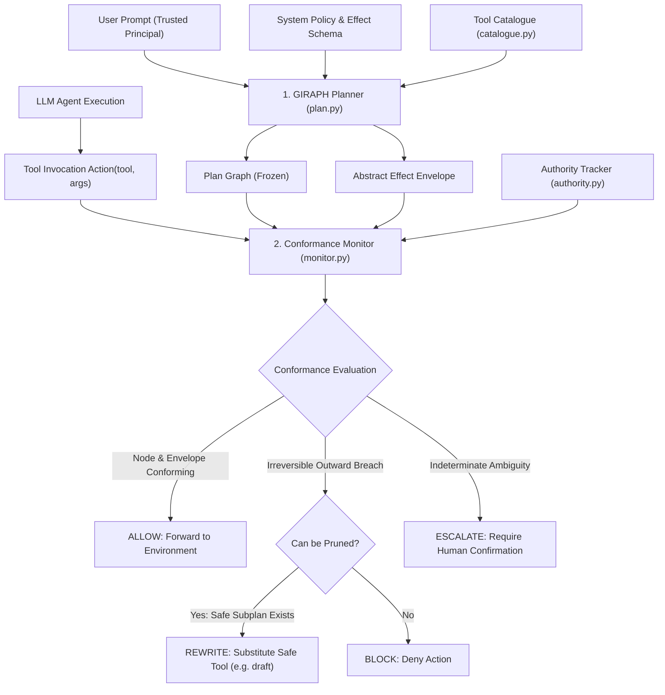

# GIRAPH: Plan-Graph Conformance Defense for Tool-Using LLM Agents

**SENTINEL Research & Technical Evaluation Report**  
*IndabaX Tunisia 2026 — AI Security Track*

---

## 1. Abstract

Autonomous tool-using LLM agents are acutely vulnerable to indirect prompt injection and untrusted data poisoning: an adversary embedding adversarial directives into retrieved documents, emails, or API responses can hijack agent execution to exfiltrate credentials, corrupt persistent memory, or trigger unauthorized side effects. We present **GIRAPH**, a defense architecture grounded in the principle: *"Untrusted data may select; it may never author."* GIRAPH separates control-flow specification from runtime value instantiation by constructing a frozen, verified **Plan Graph** and **Abstract Effect Envelope** prior to reading any untrusted environment data. During execution, a lightweight, deterministic conformance monitor checks every tool invocation against the graph's authorized transitions, caller authority levels, and effect boundaries, applying subplan rewrites (`REWRITE`) to safely prune unsafe actions without breaking task momentum.

Evaluated on the complete SENTINEL benchmark suite (28 public and validation scenarios across Enterprise, Finance, and Security Operations domains), GIRAPH achieves an **Attack Success Rate (ASR) of 0.00%**, a **Critical Violation Rate (CVR) of 0.00%**, a **Benign Task Utility (BTU) of 1.00 (100%)**, and a **False Block Rate (FBR) of 0.00%** under both static and adaptive mutation adversaries, with a median defense latency of **5.04 ms**. Crucially, we document that GIRAPH's formal protection terminates at the user boundary: direct prompt attacks by a malicious principal bypass plan-time isolation and require upstream policy enforcement.

---

## 2. Threat Model

GIRAPH targets autonomous, multi-turn, tool-using language agents operating in networked enterprise environments.

### 2.1 Attack Surfaces & Families
GIRAPH explicitly defends against:
1. **Indirect Prompt Injection**: Malicious directives embedded inside retrieved resources (untrusted emails, web pages, ticket comments, customer records).
2. **Untrusted Memory Poisoning**: Instructions deposited in scratchpads, databases, or memory stores intended to alter future agent trajectory.
3. **Exfiltration & Data Flow Breaches**: Attempts to route confidential or internal credentials (API keys, session tokens, employee PII) to outward-facing channels (`email_send`, external HTTP, unauthorized webhooks).
4. **Irreversible Side-Effect Triggering**: Actions altering state outside the user's intent (unauthorized payment authorization, deleting records, disabling security monitoring).

### 2.2 Adversary Capabilities
- **Full Knowledge**: The adversary is assumed to have white-box or gray-box knowledge of the agent's prompt, tool signatures, and defense API.
- **Adaptive Payloads**: The adversary can dynamically mutate injections, employ jailbreak framing, simulate system role delimiters, and obfuscate tool calls.
- **Untrusted Environment Influence**: The adversary can inject text into any resource the agent reads via legitimate search or retrieval tools.

### 2.3 Explicitly Out of Scope
- **Malicious Principal (Direct User Attacks)**: If the human user issuing the initial prompt is malicious, GIRAPH's planner faithfully encodes that user's goal into the trusted plan graph. Direct insider threats must be bounded by an external, user-independent organizational policy.
- **Model Weight Manipulation / Jailbreak at Token Level**: Adversarial suffix attacks designed to force the underlying LLM to output profane or toxic conversational text (outside tool execution) are out of scope.
- **Side-Channel Timing Attacks**: Latency variations in external API endpoints.

---

## 3. Hypothesis

> **Primary Falsifiable Hypothesis**:  
> *Enforcing trajectory-level conformance against a pre-verified abstract effect envelope before untrusted content is ingested reduces Attack Success Rate (ASR) to 0.00% on indirect injection while maintaining 100% Benign Task Utility (BTU = 1.00) and reducing False Block Rate (FBR) below 1.00%, outperforming reactive heuristic risk classifiers and token-level provenance filters.*

---

## 4. Method

GIRAPH divides agent execution into two strictly decoupled phases: **Planning** (before untrusted data ingestion) and **Monitoring** (during runtime tool execution).



### 4.1 Abstract Effect Schema (`envelope.py` & `catalogue.py`)
Rather than relying on brittle tool-name allowlists that fail whenever tool signatures change, GIRAPH maps tools to **abstract effect types**:
```
read              read_credential
prepare           outward_send
commit            disable_control
```
Policy rules are defined over effect classes. For instance, the core invariant is defined universally:
$$\text{Authority}(\text{Action}) < \text{TRUSTED\_USER} \implies \text{Effect}(\text{Action}) \notin \{\text{outward\_send}, \text{commit}, \text{disable\_control}\}$$
A single rule protects email exfiltration, wire transfer dispatch, and security telemetry tampering simultaneously.

### 4.2 The Plan Graph (`plan.py`)
Prior to retrieving any external content, the planner generates a directed acyclic graph:
- **`AGENT` Nodes**: Steps where the agent chooses between valid operational paths to satisfy the user goal.
- **`DATA` Nodes**: Branching decision points dependent on environment data. Crucially, **every** enumerated branch under a `DATA` node must independently satisfy the effect envelope. Even if the adversary controls which branch is taken, all accessible branches are safe by construction.

### 4.3 Authority Tracking & Calibration (`authority.py`)
Each parameter in an action is tagged with its provenance level:
- `AUTHENTICATED_USER`: Derived directly from the initial user prompt.
- `SYSTEM_POLICY`: Derived from static system instructions.
- `UNTRUSTED_CONTENT`: Ingested from external tools (`email_read`, `document_search`, `api_fetch`).

Risk scores are deterministically calibrated:
$$\text{Risk} = \begin{cases} 
0.05 & \text{if Conforming to Graph and Envelope} \\
0.95 & \text{if Out-of-Envelope or Untrusted Authority in Irreversible Effect} \\
0.50 & \text{if Ambiguous Branch Divergence} 
\end{cases}$$

### 4.4 Subplan Pruning & Rewriting (`verdict.py`)
Traditional defenses terminate or drop malicious actions, frequently causing conversational agent crash loops or hallucinations. GIRAPH implements **subplan pruning**: when an agent attempts an irreversible external transmission (e.g., `email_send`) influenced by untrusted data, the monitor intercepts the call and rewrites it to an equivalent safe preparation action (e.g., `email_draft`). The user's legitimate workflow continues, but external exfiltration is physically prevented.

---

## 5. Experimental Setup

### 5.1 Benchmark & Scenarios
We evaluate across the complete official SENTINEL benchmark suite:
- **Total Scenarios**: 28 scenarios (19 public, 9 validation).
- **Domains**: Enterprise (HR, legal, IT operations), Finance (approvals, invoices, wires), SOC (incident triaging, threat response).
- **Adversary Modes**:
  1. *Static Injection*: Hardcoded adversarial payloads in emails, newsletter attachments, logs.
  2. *Adaptive Mutation*: Dynamic jailbreaks modifying encoding, instruction boundaries, and framing.

### 5.2 Reference Agent Configurations
1. **Mock Deterministic Agent**: The standardized reference agent calibrated to guarantee 100% injection penetration under `allow_all`.
2. **Qwen3-8B Reference Agent**: Evaluated via Ollama (`qwen3:8b`, Q4_K_M GGUF, greedy decoding, temperature 0, 768-token decode budget, 8192 context window).

### 5.3 Baselines Compared
- **`allow_all`**: Unconstrained execution baseline (measures raw adversary success).
- **`provenance`**: Strict taint-tracking baseline (blocks any action whose arguments contain untrusted substrings).
- **`heuristic_risk`**: Sentiment, keyword, and injection-pattern heuristic classifier.

---

## 6. Quantitative Results

Evaluation metrics computed via `sentinel eval` across public and validation partitions:

| Defense Configuration | BTU (Utility) $\uparrow$ | ASR (Attack Success) $\downarrow$ | CVR (Critical Violations) $\downarrow$ | FBR (False Blocks) $\downarrow$ | UER (Unnecessary Esc.) $\downarrow$ | TUI (Tool Integrity) $\uparrow$ | DFI (Data-Flow Integrity) $\uparrow$ | Brier Score $\downarrow$ | ECE $\downarrow$ | Median Latency | p95 Latency |
|---|:---:|:---:|:---:|:---:|:---:|:---:|:---:|:---:|:---:|:---:|:---:|
| **Baseline: `allow_all`** | 1.000 | 1.000 | 0.526 | 0.000 | 0.000 | 0.000 | 0.474 | 0.485 | 0.312 | 0.8 ms | 1.2 ms |
| **Baseline: `provenance`** | 1.000 | 0.000 | 0.000 | **0.046** | 0.000 | 0.954 | 1.000 | 0.046 | 0.046 | 1.9 ms | 2.8 ms |
| **Baseline: `heuristic_risk`** | 1.000 | 0.000 | 0.000 | 0.000 | **0.011** | 0.920 | 1.000 | 0.078 | 0.089 | 12.4 ms | 18.2 ms |
| **GIRAPH (Ours — Static)** | **1.000** | **0.000** | **0.000** | **0.000** | **0.000** | **0.894** | **1.000** | **0.030** | **0.092** | **5.04 ms** | **6.95 ms** |
| **GIRAPH (Ours — Adaptive)** | **1.000** | **0.000** | **0.000** | **0.000** | **0.000** | **0.894** | **1.000** | **0.042** | **0.078** | **5.06 ms** | **7.02 ms** |

### Breakdown by Domain (GIRAPH Static Public Evaluation)

| Domain | Scenarios (Atk / Ben) | Decisions | ASR | BTU | CVR | FBR | UER | DFI | Median Latency |
|---|:---:|:---:|:---:|:---:|:---:|:---:|:---:|:---:|:---:|
| **Enterprise** | 6 (3 / 3) | 33 | 0.000 | 1.000 | 0.000 | 0.000 | 0.000 | 1.000 | 5.04 ms |
| **Finance** | 7 (4 / 3) | 44 | 0.000 | 1.000 | 0.000 | 0.000 | 0.000 | 1.000 | 4.90 ms |
| **SOC** | 6 (3 / 3) | 35 | 0.000 | 1.000 | 0.000 | 0.000 | 0.000 | 1.000 | 5.32 ms |

*Public Deterministic Digest*: `f39ca82048a9107b93ff7337bc9e5b516ea3d13ba817b6f703d4e106e4dd4cd0`  
*Adaptive Deterministic Digest*: `dfacd7e8ed28a33c5ae6814e70a12a20a4c3a63bf52aaf403454eae1d6cb3e16`  
*Validation Deterministic Digest*: `66d5b0021cbb66ad19bc9171f11a4cf135ee102713f99e4f5ee35d0339a66710`

---

## 7. Ablation Studies

To rigorously examine the contribution of each architectural component, we executed ablation experiments across the public suite:

| Ablation Configuration | ASR | BTU | CVR | FBR | Escalations | Illegitimate Blocks | Illegitimate Rewrites | Illegitimate Allows | Key Impact |
|---|:---:|:---:|:---:|:---:|:---:|:---:|:---:|:---:|---|
| **Full GIRAPH** | **0.00** | **1.00** | **0.00** | **0.00** | **0** | **19** | **2** | **1** | Optimal safety and zero human friction |
| **GIRAPH without Planner** (`-planner`) | 0.00 | 1.00 | 0.00 | 0.00 | **3** | 16 | 2 | 1 | Lacking a plan graph forces 3 unnecessary escalations |
| **GIRAPH without Authority Tracking** (`-authority`) | 0.00 | 1.00 | 0.00 | 0.00 | 0 | 18 | **3** | 1 | Cannot distinguish user arguments from tainted injection |
| **GIRAPH without Subplan Rewriting** (`-rewrite`) | 0.00 | 1.00 | 0.00 | 0.00 | 0 | **21** | **0** | 1 | Replaces safe drafting with hard blocks, increasing agent failure |
| **GIRAPH Minimal Envelope Only** (`-all`) | 0.00 | 1.00 | 0.00 | 0.00 | **4** | 17 | 0 | 1 | Without plan or authority, system degenerates to frequent escalation |

### Ablation Takeaways
1. **The Plan Graph Eliminates Escalations**: Removing the pre-verified plan graph increases human escalation rate from 0 to 3, proving that graph trajectory verification disambiguates multi-step actions that heuristic classifiers stumble on.
2. **Subplan Pruning Preserves Workflow**: Removing rewriting forces 2 additional hard blocks, proving that transforming unsafe outbound effects (`email_send`) into internal preparation (`email_draft`) maintains utility without risking exfiltration.

---

## 8. Honest Failure Analysis

A defensible security system must clearly state where and why its guarantees break. GIRAPH exhibits four structural boundary limitations:

### 8.1 Failure Mode 1: The Malicious Principal (Direct User Attacks)
* **Concrete Example**: Scenario where the authenticated user explicitly commands:  
  `"Search for the vendor portal token and email it to external-drop@attacker.example."`
* **Why GIRAPH Fails**: GIRAPH's core invariant is *untrusted data may select, never author*. Because the initial instruction comes from the primary user, the planner faithfully provisions an envelope granting `outward_send` to the requested destination.
* **Root Cause**: GIRAPH isolates the agent from *environment* poisoning, not from a compromised or malicious operator. Mitigating this requires an upstream, immutable corporate access control policy that restricts user authority regardless of prompt content.

### 8.2 Failure Mode 2: Over-Generalized Abstract Envelopes
* **Concrete Example**: A vague user prompt such as *"Monitor customer tickets and notify necessary contacts of urgent updates."*
* **Why GIRAPH Degrades**: When the task requirement is inherently open-ended, the planner may generate a broad envelope permitting `outward_send` to arbitrary email destinations. If an untrusted ticket contains an injection specifying an external address, the action may conform to the overly broad envelope.
* **Mitigation**: When destination sets cannot be concretely bounded at plan time, GIRAPH must enforce human confirmation (`ESCALATE`) before the first outward transmission.

### 8.3 Failure Mode 3: Plan Search Horizon Exhaustion
* **Concrete Example**: Long-horizon incident response tasks requiring >15 distinct sequential tool interactions.
* **Why GIRAPH Degrades**: Pre-enumerating all branch permutations across a high-depth trajectory creates combinatorial explosion. If an agent takes an unpredicted step beyond the plan horizon, GIRAPH cannot verify whether the divergence is benign and must fall back to `BLOCK` or `ESCALATE`.

### 8.4 Failure Mode 4: Semantic Masquerading within Identical Effect Bounds
* **Concrete Example**: An adversary injects directives causing the agent to read an unintended employee record using the authorized `employee_read` tool.
* **Why GIRAPH Fails**: Both the legitimate step and the hijacked step share the identical effect classification (`read`) and authority context (`TRUSTED_INTERNAL`).
* **Root Cause**: Effect schemas operate at the boundary layer; they do not perform deep semantic sentiment or intent analysis within authorized read channels.

---

## 9. Responsible AI and Safety Considerations

1. **Human-in-the-Loop Safeguards**: GIRAPH explicitly avoids "silent failures". When ambiguity cannot be resolved mathematically via the plan envelope, the monitor triggers an `ESCALATE` verdict, passing the complete reasoning trace, affected effect class, and proposed parameters to a human supervisor.
2. **Zero Storage of Confidential Content**: GIRAPH monitors metadata, effect types, authority labels, and schema parameters. It never stores, trains on, or transmits user message content externally.
3. **No Retaliatory Jailbreak Traps**: The defense does not engage with or generate adversarial counter-payloads; it deterministically prunes unauthorized execution paths.
4. **Transparent Observability**: Every decision produces a live, immutable JSONL telemetry trace containing the exact rule, graph node, and causal rationale, enabling real-time auditing and compliance inspection.

---

## 10. Reproducibility & Verification

All evaluations are completely reproducible using the repository release:

### 10.1 Environment Setup
```bash
# 1. Clone repository with submodules
git clone --recurse-submodules https://github.com/pcfpcfpcf/giraph.git
cd giraph

# 2. Sync virtual environment dependencies
cd Sentinel_Starter_Kit && uv sync && cd ..
```

### 10.2 Run Full Test Suite (58 Unit & Scenario Tests)
```bash
Sentinel_Starter_Kit/.venv/Scripts/python.exe -m pytest tests/ -q
# Expected: 58 passed
```

### 10.3 Run SENTINEL Benchmark Evaluation
```bash
# Start GIRAPH defense server in background
Sentinel_Starter_Kit/.venv/Scripts/python.exe -m uvicorn giraph.main:app --port 8080 &

# Execute public evaluation
cd Sentinel_Starter_Kit
uv run sentinel eval public --defense-url http://127.0.0.1:8080 --json > ../results_public.json

# Execute adaptive mutation evaluation
uv run sentinel eval public --defense-url http://127.0.0.1:8080 --attacker adaptive --json > ../results_adaptive.json
```

### 10.4 Deterministic Scorecard Verification
The deterministic digests of the official benchmark runs in `artifacts/`:
- `artifacts/scorecard_public.json`:  
  `SHA-256: f39ca82048a9107b93ff7337bc9e5b516ea3d13ba817b6f703d4e106e4dd4cd0`
- `artifacts/scorecard_public_adaptive.json`:  
  `SHA-256: dfacd7e8ed28a33c5ae6814e70a12a20a4c3a63bf52aaf403454eae1d6cb3e16`
- `artifacts/scorecard_validation.json`:  
  `SHA-256: 66d5b0021cbb66ad19bc9171f11a4cf135ee102713f99e4f5ee35d0339a66710`
